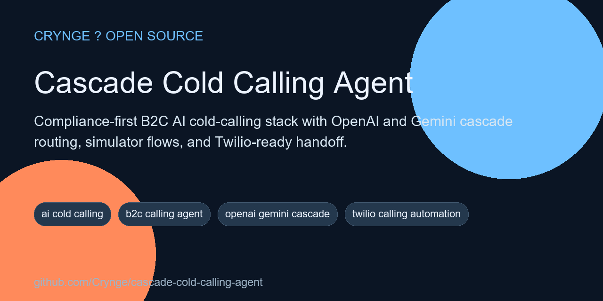
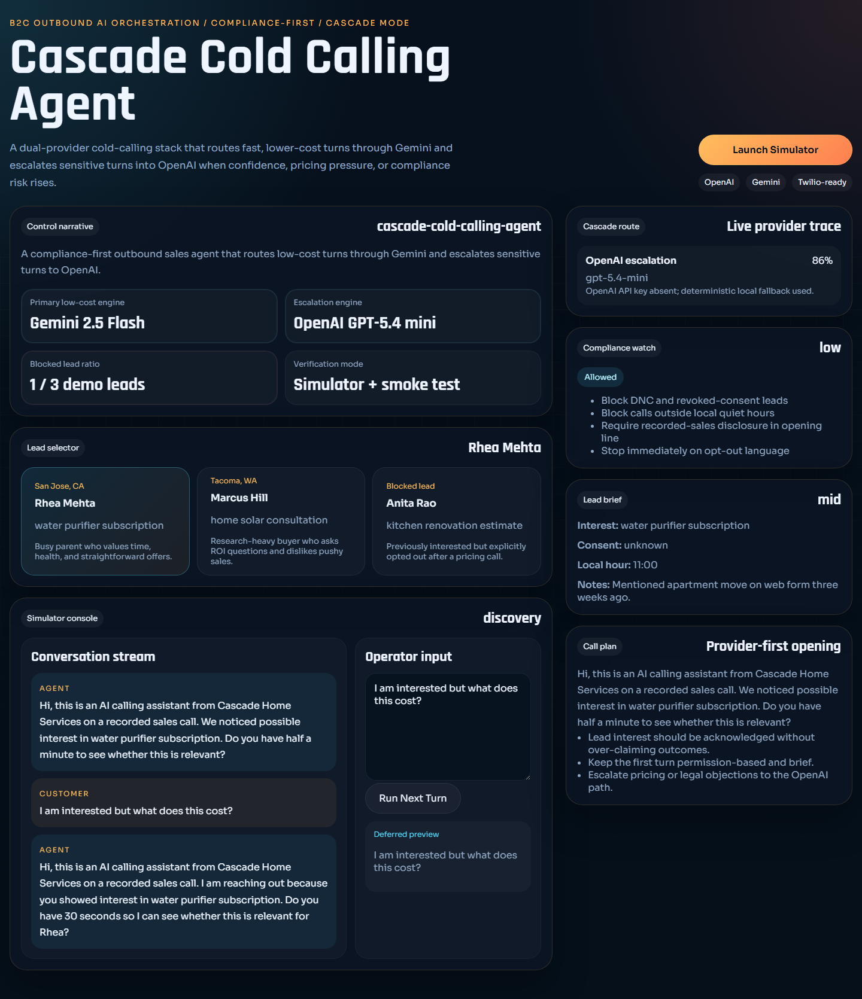

# Cascade Cold Calling Agent

<!-- portfolio-seo:start -->
  



> Compliance-first B2C AI cold-calling stack with OpenAI and Gemini cascade routing, simulator flows, and Twilio-ready handoff.

**GitHub Search Keywords:** ai cold calling, b2c calling agent, openai gemini cascade, twilio calling automation, voice ai sales, telephony compliance, call center ai

<!-- portfolio-seo:end -->

<!-- portfolio-links:start -->
<div align="center">

[Documentation](docs) &middot; [Architecture](docs/architecture.md) &middot; [Audit](docs/audit.md) &middot; [Authors](AUTHORS.md) &middot; [Contributing](CONTRIBUTING.md) &middot; [Security](SECURITY.md) &middot; [Workflows](.github/workflows)

</div>
<!-- portfolio-links:end -->

A compliance-first B2C cold-calling agent with **Cascade Mode** routing across **OpenAI** and **Gemini**. It ships as a full-stack starter with:

- a FastAPI orchestration backend
- a React operator console
- a local conversation simulator
- compliance gates for disclosure, DNC, opt-out, and quiet hours
- provider adapters for OpenAI and Gemini with deterministic local fallback
- Twilio-ready XML response generation for phone workflows

## What Cascade Mode means here

Cascade Mode is the routing policy that decides:

1. which provider should answer a turn first
2. when to escalate to a stronger provider
3. when to block the model entirely and hand off to a human or stop the call

Default behavior:

- **Gemini** handles low-cost opener, discovery, and summary work
- **OpenAI** handles sensitive objection handling, pricing pressure, compliance-heavy turns, and close/handoff moments
- if confidence drops or policy risk rises, the orchestrator falls through to the secondary provider or blocks the turn

## Why this repo is verification-friendly

Real outbound calling needs a PSTN provider and real API keys, which we cannot safely or reliably live-test in a local audit. This repo therefore separates:

- **verified local behavior**: simulator, API responses, routing, compliance checks, dashboard, and tests
- **deploy-time integrations**: OpenAI API, Gemini API, and telephony credentials

That keeps the repo runnable and auditable without pretending we performed real consumer cold calls in development.

## Architecture

```text
apps/
|-- api/
|   `-- app/
|       |-- providers/    OpenAI, Gemini, deterministic fallback
|       |-- services/     Cascade router, compliance, store, TwiML builder
|       |-- config.py
|       |-- data.py
|       |-- main.py
|       `-- schemas.py
`-- web/
    `-- src/              React dashboard and simulator
tests/
|-- test_api.py
|-- test_cascade.py
`-- web_smoke.py
```

More detail lives in [docs/architecture.md](./docs/architecture.md).

## Dashboard preview



## Official provider surface verified

This starter was aligned against official provider documentation accessed on **April 30, 2026**:

- OpenAI model catalog and endpoints:
  - [Models](https://developers.openai.com/api/docs/models)
  - [Compare models](https://developers.openai.com/api/docs/models/compare)
  - [Realtime API](https://platform.openai.com/docs/guides/realtime/function-calls)
- Gemini model and tool use docs:
  - [Gemini models](https://ai.google.dev/models/gemini)
  - [Function calling](https://ai.google.dev/gemini-api/docs/function-calling)
  - [Live API tools](https://ai.google.dev/gemini-api/docs/live-tools)

Defaults in this repo remain environment-configurable because provider model availability can change.

## Default provider configuration

- OpenAI text model: `gpt-5.4-mini`
- OpenAI voice/realtime reference model: `gpt-realtime-1.5`
- Gemini text model: `gemini-2.5-flash`
- Gemini live reference model: `gemini-2.5-flash-native-audio-preview-12-2025`

## Quick start

### 1. Backend

```bash
python -m pip install -r apps/api/requirements.txt
uvicorn apps.api.app.main:app --reload
```

### 2. Frontend

```bash
npm install
npm run build:web
npm --workspace apps/web run dev
```

### 3. Optional environment variables

```bash
OPENAI_API_KEY=
OPENAI_MODEL=gpt-5.4-mini
OPENAI_REALTIME_MODEL=gpt-realtime-1.5
GEMINI_API_KEY=
GEMINI_MODEL=gemini-2.5-flash
GEMINI_LIVE_MODEL=gemini-2.5-flash-native-audio-preview-12-2025
TWILIO_ACCOUNT_SID=
TWILIO_AUTH_TOKEN=
TWILIO_FROM_NUMBER=
PUBLIC_BASE_URL=http://127.0.0.1:8000
```

When API keys are absent, the provider adapters automatically fall back to deterministic offline behavior so the app remains testable.

## Verification

```bash
python -m pytest tests -q
npm run build:web
python -m playwright install chromium
```

Then run the live smoke test with the API and web app running locally:

```bash
python -m uvicorn apps.api.app.main:app --port 8000
npm --workspace apps/web run dev -- --host 127.0.0.1 --port 5173
python tests/web_smoke.py
```

The latest audit notes are in [docs/audit.md](./docs/audit.md).

## Compliance posture

This repo is intentionally **not** a spam starter. It includes:

- DNC blocking
- opt-out phrase detection
- quiet-hours gating
- required disclosure prompts
- call-risk scoring
- human-handoff recommendations

If a lead is DNC, revoked, or outside allowed hours, the orchestrator blocks the call.

## License

MIT
